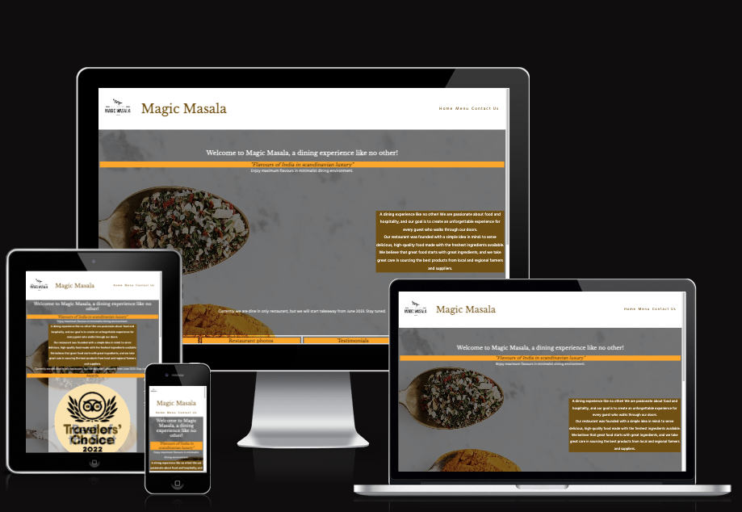
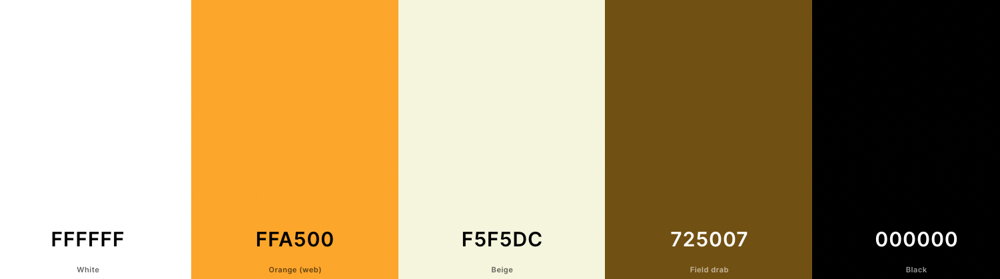

# Masala magic
(Developer: Yash Gurjar)

[Live webpage](https://ysgurjar.github.io/ci-pp1-magic-masala/index.html)

## Table of Content

1. [Project Goals](#project-goals)
    1. [User Goals](#user-goals)
    2. [Site Owner Goals](#site-owner-goals)
2. [User Experience](#user-experience)
    1. [Target Audience](#target-audience)
    2. [User Requrements and Expectations](#user-requrements-and-expectations)
    3. [User Stories](#user-stories)
3. [Design](#design)
    1. [Design Choices](#design-choices)
    2. [Colour](#colours)
    3. [Fonts](#fonts)
    4. [Structure](#structure)
    5. [Wireframes](#wireframes)
4. [Technologies Used](#technologies-used)
    1. [Languages](#languages)
    2. [Frameworks & Tools](#frameworks-&-tools)
5. [Features](#features)
6. [Testing](#validation)
    1. [HTML Validation](#HTML-validation)
    2. [CSS Validation](#CSS-validation)
    3. [Accessibility](#accessibility)
    4. [Performance](#performance)
    5. [Device testing](#performing-tests-on-various-devices)
    6. [Browser compatibility](#browser-compatability)
    7. [Testing user stories](#testing-user-stories)
8. [Bugs](#Bugs)
9. [Deployment](#deployment)
10. [Credits](#credits)
11. [Acknowledgements](#acknowledgements)

## Project Goals 

### User Goals
- Finding a restaurant in Esbjerg serving Indian food.
- Menu with price in local currency.
- Location and contact details of restaurant.

### Site Owner Goals
- Market the restaurant business food among local and tourists.
- Provide contact information to customers and opening hours 
- Provide a means to customers to contact the restaurant

## User Experience

### Target Audience
- Locals and tourists looking to dine in Esbjerg
- People looking to organise events at the resturant
- Tie up with event organisers for catering

### User Requrements and Expectations

- Simple to navigate
- Easy to view menu both on phone and computer
- Able to contact restaurant via phone or email
- Able to reach restaurant in opening hours

### User Stories

#### First-time User 
- As a first time user, I want to know the cuisine and theme of restaurant
- As a first time user, I want to know if it is dine in or take away or both
- As a first time user, I want to know the reviews from others
- As a first time user, I want to know the credibility of the restaurant and if it is famous

#### Returning User
- As a returning user, I want to see the regular menu
- As a returnign user, I want to see what's coming soon
- As a returning user, I want to be able to give feedback or reach out for organising a small event.

#### Site Owner 
- As the site owner, I want customers to know the type of food being served
- As the site owner, I want to publish recent awards won by restaurant
- As the site owner, I want to show that we are always introducing new food to keep things interesting

## Design

### Design Choices
The webpage was designed with white, brass and black material to give customer the feeling of luxury. The while marbel background with a spoon mix of spices represents the the theme as well.
The web content is kept minimalist to match with scandinavian minimalism

### Colour
For the colour saffron, white and black colors have been chosen to keep the them minimalist and luxurious. Safroon matches color of mango which is very famour indian fruit and and represents an expensive spcice as well. Beige color - a variation of white is also introduced to keep some contrast between white header and footer and body elements. These colors are further combined to provide enough contrast as well.
 

### Fonts
- **Libre Baskerville** - serif typeface has been used for headings to highlight them. 
- **Hind Guntur** - sans serif typeface is used for paragraph and other body text. Together they create a good contrast of fonts as user navigates through website.

### Structure
-The homepage is laid out in a known fashon. A top nav bar with some introduction text.
-Includes a clicable logo which brings user back to home page.
- A homepage with about us, awards, coming soon, reviews and restaurant photos
- A menu page
- Contact us section with location displayed on google maps