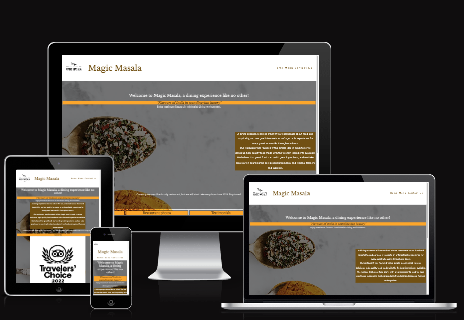

# Masala magic
(Developer: Yash Gurjar)

[Live webpage](https://ysgurjar.github.io/ci-pp1-magic-masala/index.html)

## Table of Content

1. [Project Goals](#project-goals)
    1. [User Goals](#user-goals)
    2. [Site Owner Goals](#site-owner-goals)
2. [User Experience](#user-experience)
    1. [Target Audience](#target-audience)
    2. [User Requrements and Expectations](#user-requrements-and-expectations)
    3. [User Stories](#user-stories)
3. [Design](#design)
    1. [Design Choices](#design-choices)
    2. [Colour](#colours)
    3. [Fonts](#fonts)
    4. [Structure](#structure)
    5. [Wireframes](#wireframes)
4. [Technologies Used](#technologies-used)
    1. [Languages](#languages)
    2. [Frameworks & Tools](#frameworks-&-tools)
5. [Features](#features)
6. [Testing](#validation)
8. [Bugs](#Bugs)
9. [Deployment](#deployment)
10. [Credits](#credits)

## Project Goals 

### User Goals
- Finding a restaurant in Esbjerg serving Indian food.
- Menu with price in local currency.
- Location and contact details of restaurant.

### Site Owner Goals
- Market the restaurant business food among local and tourists.
- Provide contact information to customers and opening hours 
- Provide a means to customers to contact the restaurant

## User Experience

### Target Audience
- Locals and tourists looking to dine in Esbjerg
- People looking to organise events at the resturant
- Tie up with event organisers for catering

### User Requrements and Expectations

- Simple to navigate
- Easy to view menu both on phone and computer
- Able to contact restaurant via phone or email
- Able to reach restaurant in opening hours

### User Stories

#### First-time User 
- As a first time user, I want to know the cuisine and theme of restaurant
- As a first time user, I want to know if it is dine in or take away or both
- As a first time user, I want to know the reviews from others
- As a first time user, I want to know the credibility of the restaurant and if it is famous

#### Returning User
- As a returning user, I want to see the regular menu
- As a returnign user, I want to see what's coming soon
- As a returning user, I want to be able to give feedback or reach out for organising a small event.

#### Site Owner 
- As the site owner, I want customers to know the type of food being served
- As the site owner, I want to publish recent awards won by restaurant
- As the site owner, I want to show that we are always introducing new food to keep things interesting

## Design

### Design Choices
The webpage was designed with white, brass and black material to give customer the feeling of luxury. The while marbel background with a spoon mix of spices represents the the theme as well.
The web content is kept minimalist to match with scandinavian minimalism

### Colour
For the colour saffron, white and black colors have been chosen to keep the them minimalist and luxurious. Safroon matches color of mango which is very famour indian fruit and and represents an expensive spcice as well. Beige color - a variation of white is also introduced to keep some contrast between white header and footer and body elements. These colors are further combined to provide enough contrast as well.
 

### Fonts
- **Libre Baskerville** - serif typeface has been used for headings to highlight them. 
- **Hind Guntur** - sans serif typeface is used for paragraph and other body text. Together they create a good contrast of fonts as user navigates through website.

### Structure
- The homepage is laid out in a known fashon. A top nav bar with some introduction text.
- Includes a clicable logo which brings user back to home page.
- A homepage with about us, awards, coming soon, reviews and restaurant photos
- A menu page
- Contact us section with location displayed on google maps

## Wireframes
The wireframes have been drawn and redrawn on physical notebook. For the sanctity of the document, they have not been included. Most of the wireframe designs were implemented and some were kept for the next release.

## Technologies Used

### Languages
- HTML
- CSS

### Frameworks & Tools
- Git
- Gitpod
- Github
- Canva
- Font awesome
- Google fonts
- Tinypng
- Color palatte generator

## Features

The list of features that have been implemented and the list of features that are to be implemented in next sprint can be found below.

### Features - implemented

#### Logo

- Clicable, fixed size logo that brings the users back to home page.
- Implemented on all three pages.

#### Navigation
- Laid out at known, top section of webpage. Included in semantic header section for accessibility.
- Implemented on all three pages.
- Fully responsive to small screen size

#### Menu
- Laid out with alternative image on left and right. The grid has a fixed width layout to avoid blowing out proportion when viewed on large screen.
- Fully responsive. The menu changes to single column layout when viewed on small screen

#### Slide show
- 4 slide show on each of the subfeatures
- Fully responsive. Changes to single column layout on a small screen

#### Contact us
- Laid out with form validation. The user must enter the phone name, email and phone number with an alternate to write additional text.
- User interaction and feedback provided

The following gif highlights the interaction

#### Footer
- Laid out at bottom. Fully responsive and available on all pages
- Includes interactive link to social media that opens in new tab and opening hours

### Features - to be implemented in next sprint
- additional option in contact us form to provide option to choose between inquiry, table reservation and feedback
- additoinal option on home page with a pop up to show that restaurant will be closed on certain days
- Make the "Coming soon - takeaway" section on home page bit more obvious

## Testing

All HTML and css files were ran through jigsaw validator. 
- No errors found
- one warning found - the warning was about possible misuse of aria label. The aria label is applied to the price of the menu item. As the site developer the label has been left as it is to provide users with visual impairments extra confidence that they are looking at the "price". The price is in local currency of danish kroner, which may not be known to every one and therefore for accessibility reason it has been left as it is.

### Performance 

It has been tested with lighthouse. The webiste scores high on accessibility.

### Device and browser dependency

The website is found responsive upto 320 px width (similar to iphone-5) and no broswer related issued were found on mozilla and firefox.

## Bugs

All the bugs have been fixed except one. The anchor tag around logo sometimes takes whitespace when viewed on potrait mode on tablets.

## Deployment

The webiste was deployed using github page.

The website was deployed using GitHub Pages by following these steps:
1. In the GitHub repository navigate to the Settings tab
2. On the left hand menu select Pages
3. For the source select Branch: master
4. After the webpage refreshes automaticaly you will se a ribbon on the top saying: "Your site is published at https://4n4ru.github.io/CI_MS1_BodelschwingherHof/"

You can for fork the repository by following these steps:
1. Go to the GitHub repository
2. Click on Fork button in upper right hand corner

You can clone the repository by following these steps:
1. Go to the GitHub repository 
2. Locate the Code button above the list of files and click it 
3. Select if you prefere to clone using HTTPS, SSH, or Github CLI and click the copy button to copy the URL to your clipboard
4. Open Git Bash
5. Change the current working directory to the one where you want the cloned directory
6. Type git clone and paste the URL from the clipboard ($ git clone https://github.com/YOUR-USERNAME/YOUR-REPOSITORY)
7. Press Enter to create your local clone.

## Credits

- The images were taken from pexels were clicked by the following photgraphers.
1. Dana Tentis
2. Jessica Lewis Creative
3. Karolina Grabowska
4. Marvin Ozz
5. Dapur Melodi
6. Dino Uniyal
7. Malidate Van
8. Shahbaz Ansari.

A few images were renamed and reference document was accidently deleted. However, I have tried my best to give credits to those who contributed.

- Sincere thank you to my mentor (Slack Mo_Shami) for words of assurance and pushing me try my best descpite unfavorable circumstances.
